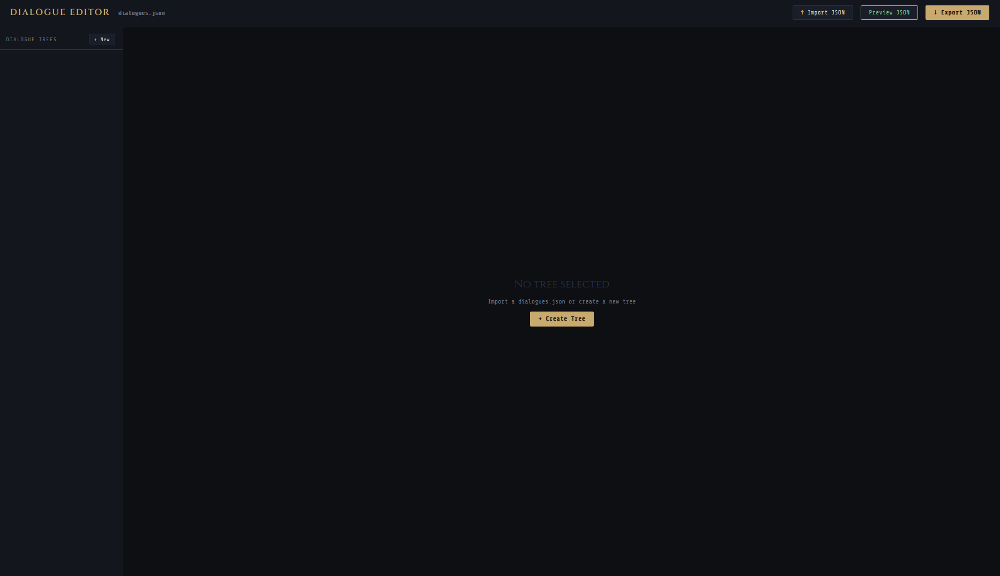

# Dialogue Editor

A comprehensive dialogue system for Unity games featuring a visual HTML-based editor and robust C# runtime with support for dialogue trees, branching conversations, player choices, and quest-gated dialogue.

## 📋 Overview

The Dialogue Editor is a complete solution for managing NPC conversations in your game. It includes:

- **Visual Web Editor** (`dialogue-editor.html`) — A browser-based UI for creating and editing dialogue trees
- **Runtime System** (C# scripts) — Handles dialogue playback, choice rendering, and condition evaluation
- **Dialogue Data** — Structured JSON-compatible data format for storing conversation trees
- **Quest/Flag System** — Gate dialogue behind game state (completed quests, flags, etc.)

## 📸 Preview

### Web Editor

*Visual dialogue tree editor with dark theme and real-time preview*

### In-Game Preview

*Dialogue system running in-game with NPC conversation and player choice options*

---

## 🎯 Core Features

### Dialogue Trees
- Organize conversations into named dialogue trees
- Each tree has a `start` node as the entry point
- Nodes support speaker name, body text, and side effects

### Player Choices
- Present multiple dialogue options to the player
- Each choice leads to a specific next node
- Fully customizable choice button styling

### Conditional Dialogue
- Gate conversations behind game flags or quest completion
- NPCs maintain an ordered list of dialogue trees with conditions
- Only the first condition that passes will play

### Typewriter Effect
- Animated text reveal effect (configurable speed)
- Smooth character-by-character text display

### Game State Management
- Boolean flag system for tracking quest progress
- Simple API: `GameFlags.Set()`, `GameFlags.IsSet()`, `GameFlags.Reset()`

---

## 🔧 Core Components

### `DialogueManager` (Singleton)
Main runtime handler for displaying dialogues in your game.

**Key Features:**
- Singleton pattern (access via `DialogueManager.Instance`)
- Displays speaker name and dialogue text
- Dynamically spawns choice buttons
- Configurable typewriter speed
- Supports Continue/Dismiss buttons for end-of-branch

**Inspector Setup:**
- Dialogue Panel (canvas root)
- Speaker Name Text (TMP_Text)
- Body Text (TMP_Text)
- Choice Container (Transform)
- Choice Button Prefab
- Continue/Dismiss Button

### `NPCDialogue` (Component)
Attach this to any NPC GameObject to enable dialogue.

**Features:**
- Ordered list of conversations (dialogue tree IDs with conditions)
- Automatically evaluates conditions when player interacts
- Plays the first matching dialogue tree
- Supports fallback (unconditional) dialogue

**Supported Conditions:**
- `None` — Always plays
- `FlagSet` — Plays when `GameFlags.IsSet(flagId) == true`
- `FlagNotSet` — Plays when flag is not set
- `QuestComplete` — Alias for `FlagSet` (for readability)

### `GameFlags` (Static Manager)
Minimal boolean flag store for tracking game state.

**API:**
```csharp
GameFlags.Set(string id, bool value = true);    // Set a flag
GameFlags.IsSet(string id);                      // Check if flag is set
GameFlags.Reset();                               // Clear all flags
```

### `DialogueData` (Data Classes)
Pure C# data structures—no Unity dependencies.

**Structure:**
- `DialogueDatabase` — Root container
- `DialogueTree` — Named conversation tree (id + nodes)
- `DialogueNode` — Single beat (speaker, text, choices, effects)

### `dialogue-editor.html` (Web UI)
Modern, keyboard-friendly dialogue tree editor with:
- Sidebar tree navigation
- Rich text editing
- Choice management
- Dark theme with professional styling
- Real-time preview

---

## 🎮 Usage Preview

### Setting Up an NPC

1. Create a GameObject for your NPC
2. Attach `NPCDialogue` component
3. Add Conversation entries with:
   - Dialogue Tree ID (from your JSON)
   - Optional condition (flag name)
4. Attach `PlayerInteract` trigger or call `NPCDialogue.StartDialogue()`

### Creating a Conditional Dialogue Flow

```csharp
// In your game logic:
GameFlags.Set("elder_quest_complete", true);

// NPCDialogue will now show the post-quest dialogue instead of intro
```

### Dialogue Data Example

```json
{
  "dialogues": [
    {
      "id": "elder_intro",
      "nodes": [
        {
          "nodeId": "start",
          "speaker": "Elder",
          "body": "Welcome, adventurer!",
          "choices": [
            {
              "text": "Who are you?",
              "next": "node_1"
            },
            {
              "text": "I must go.",
              "next": "end"
            }
          ]
        }
      ]
    }
  ]
}
```

---

## 💡 Key Design Principles

- **No Editor Dependencies** — Dialogue data uses simple JSON (portable, version-control friendly)
- **Modular** — Use only the components you need
- **Extensible** — Add new condition types or side effects easily
- **Performance** — Minimal overhead; suitable for large dialogue databases
- **UI-Agnostic** — Works with TextMesh Pro or standard UI.Text

---

## 🚀 Getting Started

1. **Add the scripts** to your Unity project
2. **Create a DialogueManager** in your scene (or use the prefab if provided)
3. **Design your dialogue trees** using `dialogue-editor.html`
4. **Export the JSON** and load it into your game
5. **Attach NPCDialogue** to your NPC characters
6. **Wire up UI panels** in the DialogueManager inspector

---

## 📝 Notes

- **GameFlags** is intentionally simple — replace with your own save system for persistence
- **Typewriter effect** is optional — set speed to 0 to disable
- **Choice buttons** are dynamically spawned — customize the prefab for your UI style
- Dialogue tree IDs must be **unique** within the database

---

## 🗺️ Project Plans

### 3D Dialogue System
An extended version of the Dialogue Editor for 3D games with enhanced features:

**Planned Features:**
- [ ] **3D Camera Control** — Dynamic camera angles during dialogue (focus on speaker)
- [ ] **Animation Integration** — Play character animations (talking, gesturing, expressions)
- [ ] **Emotion System** — Track NPC emotional state (happy, angry, sad, neutral) with visual feedback
- [ ] **Dialogue Pathfinding** — NPCs move to player during conversation
- [ ] **Audio Support** — Voice lines with lip-sync synchronization
- [ ] **Multiple Languages** — Built-in localization system for dialogue text
- [ ] **Quest System Integration** — Automatic quest marker placement based on dialogue triggers
- [ ] **Branching Logic** — Advanced conditions (inventory items, relationship levels, time-based)
- [ ] **Screen Positioning** — Customizable UI anchoring for dialogues in 3D space

**Architecture:**
- [ ] Enhanced `DialogueManager3D` with Animator support
- [ ] `NPCAnimator` component for character expression synchronization
- [ ] `LocalizationManager` for multi-language support
- [ ] Extended JSON schema to support animation events and emotions
- [ ] Web editor upgrade to handle 3D-specific fields

**Timeline:**
- [ ] Phase 1: Camera control and animation integration
- [ ] Phase 2: Emotion system and visual feedback
- [ ] Phase 3: Audio support and localization
- [ ] Phase 4: Advanced quest integration and branching logic

---

## 📦 Related Projects

- [ ] **Quest System** — Companion system for tracking objectives and gating dialogue
- [ ] **Save System** — Persistent GameFlags and dialogue progression
- [ ] **Character Relationship** — Track relationship scores affecting dialogue outcomes
- [ ] **UI Theme System** — Customizable dialogue UI colors and fonts

---

**Ready to create immersive conversations for your game!** 🎭
